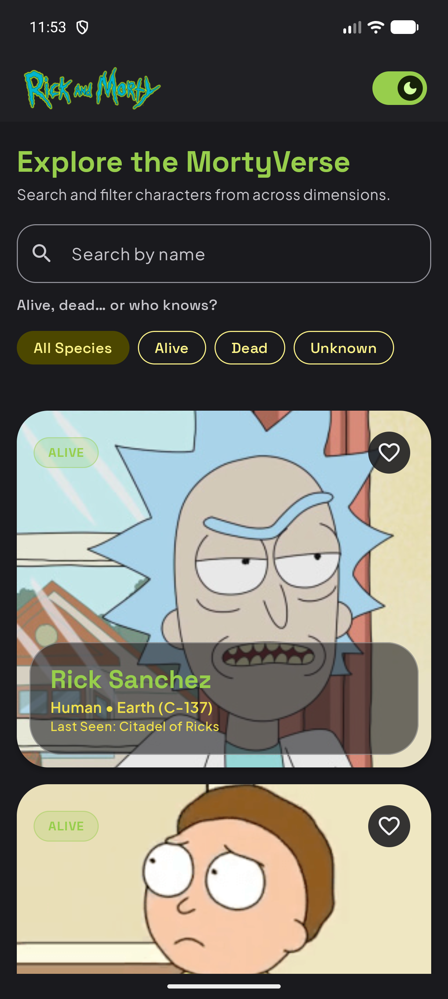
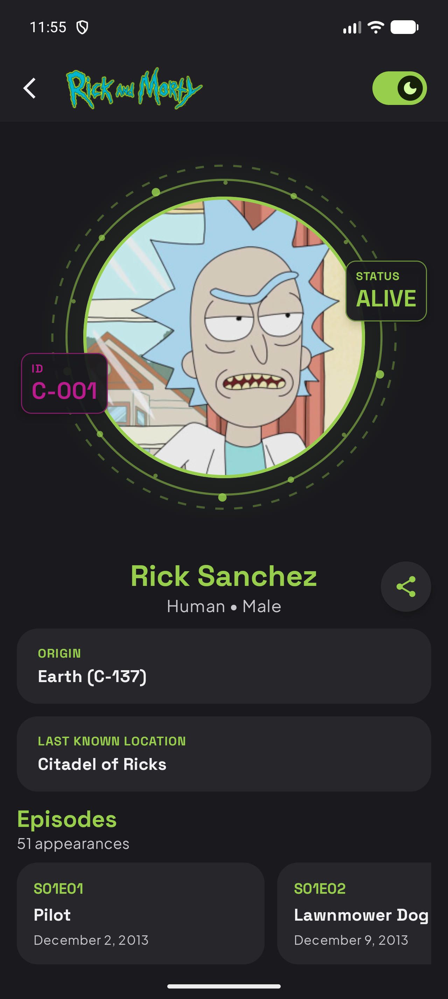
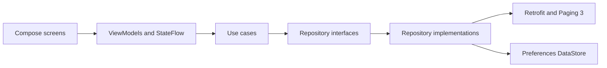

# MortyVerse

MortyVerse is an Android character explorer built as a technical assessment. It provides an infinitely paginated character directory, search and status filters, character details, episode appearances, persistent favorites, and a theme selector.

## Screenshots

<p align="center">
  
  
</p>

## Features

- Infinite character list backed by Paging 3.
- Pages of 20 characters, loaded as the user approaches the end of the list.
- Debounced character search by name.
- Status filters for all, alive, dead, and unknown characters.
- Scroll position reset when a search or status filter changes.
- Initial and pagination loading states with animated skeletons.
- Empty, refresh error, and pagination error states with retry actions.
- Character detail fetched by ID.
- Episode appearances loaded through the single or multi-ID API endpoints.
- Independent episode loading and error states, keeping character details visible if episode loading fails.
- Persistent favorites and theme preference with DataStore.
- Light and dark themes.
- Native SplashScreen API.
- Character sharing through the Android Sharesheet.
- Accessibility semantics for headings, collections, actions, state descriptions, loading announcements, and errors.

## Assignment adaptation

| Original requirement | MortyVerse implementation |
| --- | --- |
| Marvel characters | Rick and Morty characters |
| Comics | Episode appearances |
| Character list pagination | Paging 3 with 20-item pages and a prefetch distance of 5 |
| Filter by name | Debounced server-side name filter |
| Character description | Status, species, gender, origin, and last known location |
| Comic name, image, and date | Episode code, name, and air date |

The Rick and Morty episode endpoint does not provide episode artwork, and its character model does not include an editorial description. The UI therefore presents the closest API-backed information instead of using invented or unrelated data.

## Architecture

The project follows a layered architecture with unidirectional data flow and dependency inversion between the domain and data layers.



- **Presentation:** Jetpack Compose screens, immutable UI state, ViewModels, and lifecycle-aware state collection.
- **Domain:** framework-independent models, repository contracts, and focused use cases.
- **Data:** Retrofit service, DTO mappers, PagingSource, repository implementations, and DataStore preferences.
- **Dependency injection:** Koin modules provide networking, repositories, use cases, ViewModels, and the injected IO dispatcher.

The UI observes `StateFlow` and `PagingData`, sends user events to ViewModels, and renders loading, content, empty, and error states. Network work is moved to an injected IO dispatcher. Suspending repository operations return Kotlin `Result`, while `CancellationException` is rethrown to preserve structured concurrency.

## Project structure

```text
com.tapasco.characters
├── core
│   ├── di                  # Koin modules and dispatcher qualifiers
│   └── utils               # Coroutine and query helpers
├── data
│   ├── mapper              # DTO-to-domain mapping
│   ├── preferences         # Preferences DataStore
│   ├── remote
│   │   ├── api             # Retrofit endpoints
│   │   ├── dto             # Network models
│   │   └── paging          # CharactersPagingSource
│   └── repository          # Repository implementations
├── domain
│   ├── model               # Character, location, and episode models
│   ├── repository          # Data contracts
│   └── usecase             # Application use cases
├── presentation
│   ├── characters          # Character list, filters, cards, and skeletons
│   ├── detail              # Detail, hero, episodes, and states
│   └── navigation          # Type-safe routes and app navigation
└── ui
    └── theme               # Color, typography, motion, and skeleton tokens
```

## Tech stack

- Kotlin 2.2
- Jetpack Compose with Material 3
- AndroidX Navigation Compose with type-safe routes
- AndroidX Paging 3
- Retrofit, OkHttp, and Gson
- Kotlin Coroutines and Flow
- Koin
- Preferences DataStore
- Coil
- AndroidX SplashScreen
- JUnit 4, Coroutines Test, Paging Test, and Compose UI Test
- Spotless with ktlint

## Requirements

- Android Studio with Android SDK 37 installed.
- JDK 21. The Gradle daemon toolchain is configured in the project.
- Android 7.0 / API 24 or newer for the target device.
- Internet access for remote character and episode data.

No API key or local secret is required.

## Getting started

```bash
git clone https://github.com/datapasko/character-explorer.git
cd character-explorer
./gradlew assembleDebug
```

Open the project in Android Studio and run the `app` configuration on an emulator or physical device.

## Testing and quality checks

The project currently contains 18 local unit tests and 12 instrumented tests.

| Test layer | Main coverage |
| --- | --- |
| Unit | ViewModel state transitions, search debounce, favorites, repository mapping, pagination, API failures, episode batching, and coroutine cancellation |
| Instrumented | Character list interactions, filter scroll reset, detail states, sharing, accessibility semantics, and DataStore persistence |

Run local unit tests:

```bash
./gradlew testDebugUnitTest
```

Run instrumented tests with an emulator or device connected:

```bash
./gradlew connectedDebugAndroidTest
```

Check formatting:

```bash
./gradlew spotlessCheck
```

Build and run all local verification tasks:

```bash
./gradlew assembleDebug testDebugUnitTest spotlessCheck
```

## Error handling

- `PagingSource` maps network and HTTP failures to Paging load states.
- A `404` caused by filters is treated as an empty result.
- Initial and append failures expose separate retry actions.
- Character and episode requests expose independent states.
- Episode failures do not discard successfully loaded character data.
- Coroutine cancellation is propagated rather than converted into a business failure.

## Git workflow

The repository uses a Gitflow-style workflow:

- `main` for stable delivery.
- `develop` for feature integration.
- `feature/*` branches for isolated work.

The history includes feature merges for dependency injection, networking, the character list, and character detail.

## Possible next steps

- Add a dedicated favorites-only destination.
- Cache remote content with Room for offline support.
- Add localization beyond English.
- Add screenshot regression tests and CI verification.

## API and assets

Character and episode data is provided by the community-maintained [Rick and Morty API](https://rickandmortyapi.com/). Rick and Morty imagery is used only to demonstrate this technical assessment.
